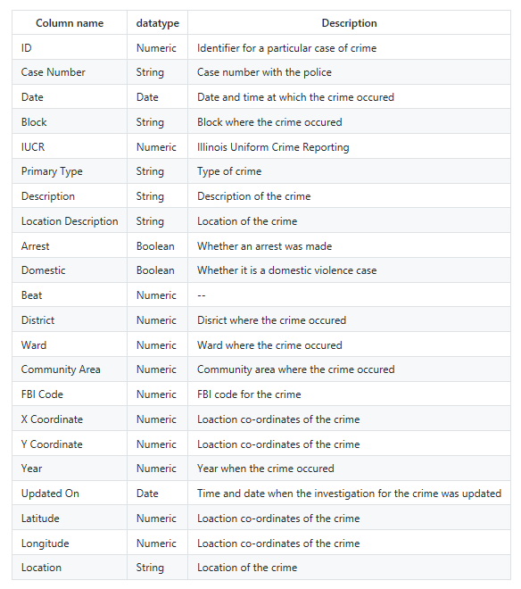
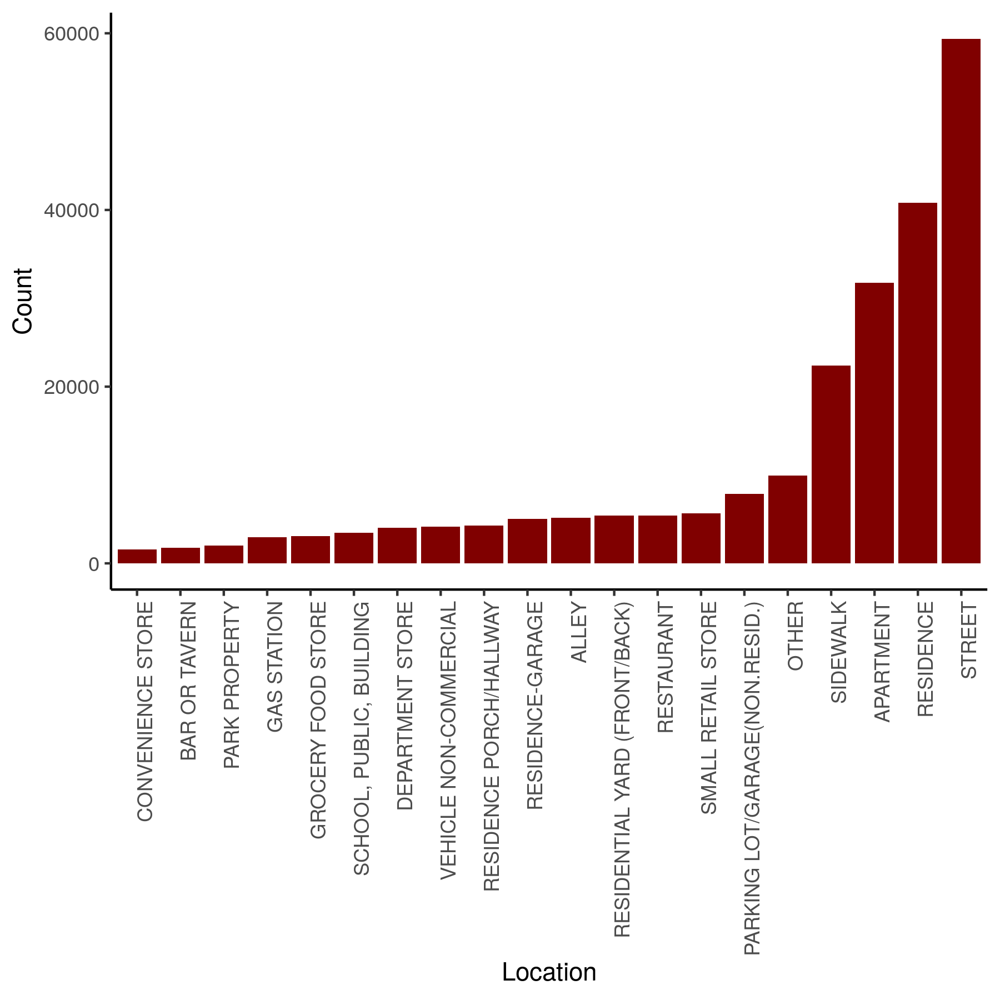

```{r setup, include=FALSE}
knitr::opts_chunk$set(echo = TRUE)
knitr::opts_knit$set(root.dir = here::here())
```

# Crime Analysis in Chicago 

**Team:** Fan Wu & Sreya Guha

**Date:** November 23, 2018

## Table of contents

* Introduction
* Dataset
    + Overview
    + Data Wrangling
* Exploratory Data Analysis
* Prediction Model - Decision Tree
    + Modeling
    + Results
* Limitations
* References

## Introduction

The goal of the project is to analyze the Chicago crimes dataset and build a model that gives us the strongest predictors of an arrest result. Essentially, this dataset contains the Type of Crime, Location, Sub Category of the Crime, Type of Vicinity and Whether the arrest was possible or not.

This project consists of two phases - Analyzing the dataset, Building a Decision Tree model.

## Dataset

### Overview

This dataset reflects reported incidents of crime (with the exception of murders where data exists for each victim) that occurred in the City of Chicago from 2016 to 2017. Data is extracted from the Chicago Police Department's CLEAR (Citizen Law Enforcement Analysis and Reporting) system. In order to protect the privacy of crime victims, addresses are shown at the block level only and specific locations are not identified. The data is in the following form:

*Table 1. Chicago Crime Raw Dataset* 

```{r raw data, echo = FALSE}
crime_rawdata <- head(read.csv("./data/crime_1617_raw_data.csv"))
knitr::kable(crime_rawdata)
```

This dataset has 276819 rows and 24 columns. 

*Table 2. Chicago Crime Dataset Dictionary*



### Data Wrangling

The first step is to identify all null values in the dataset and remove them.
The second step is to modify the datatypes for the below features since they have to be pre-processed in order to fit the model.

- Primary.Type: mapping the categorical values to numerical values
- Location.Description: mapping the categorical values to numerical values
- Date: changing its datatype to Date
- Domestic: changing the boolean values to 1/0
- Arrest: changing the boolean values to 1/0

*Table 3. Chicago Crime Clean Dataset*
```{r data wrangling, echo = FALSE}
crime_data <- head(read.csv("./data/crime_1617_clean_data.csv"))
knitr::kable(crime_data)
```

## Exploratory Data Analysis

Before doing the modeling, we need some preliminary investigations of the dataset to identify its patterns.

First, we look at the top crime types in Chicago from 2016-2017.

*Figure 1. The Top Crime Types in Chicago*


There were more Theft crime incidents (37.7%) compared to the rest of the offenses. Sexual assault cases came in at 20.2% followed by Arson (12.2%). We can also see drug cases at 4.2% followed by far by criminal trespass cases at 2.4%.

To continue, we want to know the hot locations where most crimes are reported.

*Figure 2. The Top Crime Locations in Chicago*


We can see that most crimes were committed on the streets (23.7% )followed by residences (16.2%). And then both apartments (12.6%) and sidewalks (8.9%). This figure shows that crime patterns were consistent over multiple regions.

Let's now compare the number of crimes with the number of arrests in 2016 and 2017.

*Figure 3. Compare Crime and Arrest*
#

From the above plots we can see that the number of arrests recorded each year is very less compared to the number of crimes. The instances of theft is 94556 whereas the number of arrests for theft is 8479. This means that only 8.9% of the accused actually were arrested. This is followed by cases for Sexual assault where only 20% of the criminals got arrested.

## Prediction Model - Decision Tree

### Modeling

The benefit of using Decision Tree models is that they are easily understood due to their graphical representation and the simple tests conducted at each node. The tree is built from a set of rules that partition the data by examining value frequency of attributes. At each node the attribute's value is evaluated and depending on the outcome it either takes a route to the next decision node or terminates in a leaf node. A leaf or terminal node indicates the examples of the predicted class.

This is suitable to our dataset which has features like Time, Location, Domestic crime which do not have a direct connection with one another. We thus conducted a Decision Tree analysis on the cleaned dataset for all types of crimes to see the best predictors for an arrest result in Chicago. The features we selected to are: 

|  Features  |  Description  |
|------------|---------------|
|Primary.Type| The type of crime|
|Location.Description| The location of the crime|
|Domestic    | Whether it was a domestic violence case|
| Latitude  | The latitude of the crie location  |
|  Longitude  |  The longitude of the crime location  |

Since the two features above (i.e. Primary.Types, Location.Description) were categorical, we converted features into numerical values in the data wrangling section. 

A decision tree can take many hyper-parameters. We performed our experiments with the parameters: [max depth=5] which gave us an accuracy around 87%, more details about this will be shown in the results section. At the end, more than 50 nodes were created, we can conclude that this tree can be used as a suitable predictor for arrest. 

### Results

The final tree can be visualized below:

*Figure 4. Decision Tree*


We performed 10-fold cross validation to calculate the accuracy of our model. The table below shows the 10 cross validation scores:

*Table 4. Cross Validation Scores*
```{r cross validation results, echo = FALSE}
cv <- read.csv("./results/crime_1617_decisiontree_cvscores.csv")
knitr::kable(cv)
```

The average of above 10 scores is around 87%.

To calculate the imprtant features we decided to use Scikit-learn's `feature_importances_`. This function computes the importance of a feature and it is computed as the (normalized) total reduction of the criterion brought by that feature. It is also known as the Gini importance.

*Table 5. Feature Importances*
```{r features importances, echo = FALSE}
features <- read.csv("./results/crime_1617_decisiontree_featuresimportance.csv")
knitr::kable(features)
```

Thus we conclude that the type of crime (i.e.Primary.Type), description of the location where the incident occurred (i.e.Location.Description) and whether the incident was domestic-related or not (Domestic) are the best indicators of an Arrest.

## Limitations

First, due to the GitHub space constraint, we only used the dataset for 2016 and 2017. In fact, the entire dataset we downloaded from Kaggle is from 2012 to 2017. If we includes more years into our analysis, the results may change.

Additionally, due to the timing issue, we only performed a decision tree model and archieved a 87% accuracy rate. To implement it, we can perform more modelings such as linear regression model, logistic regression, etc. Then, based on the assumptions of each model and its accuracy result, we can find the optimal model for this practice.

Lastly, in the decision tree model, we choose the maximum depth to be 5 by considering the trade off between time complexity and accuracy rate. For future implementation, we can perform more analysis about this trade off and pick the optimal depth. 


## References

1. [Analysis and Prediction of Crimes in Chicago](https://github.com/cnreddy11/Analysis-and-Prediction-of-Crimes-in-Chicago/blob/master/Chicago%20Crimes%20Analysis.ipynb)
2. [Crimes in Chicago - Kaggle](https://www.kaggle.com/currie32/crimes-in-chicago)
3. [Predictive Analysis of Crimes in Chicago](http://sites.warnercnr.colostate.edu/cnreddy/predictive-analysis-crimes-chicago/)
4. [Chicago Crime Mapping: Magic of Data Science and Python](https://hackernoon.com/chicago-crime-mapping-magic-of-data-science-and-python-f2ecad74a597)