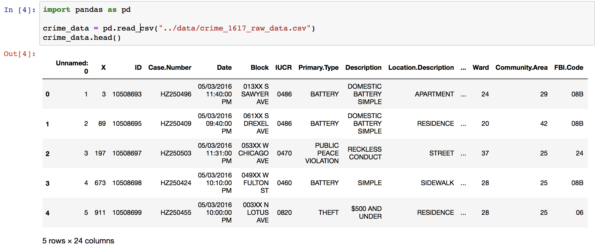
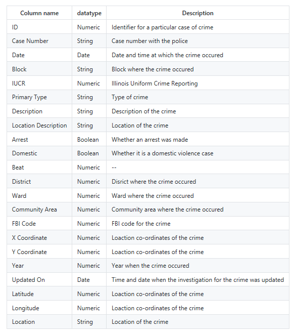
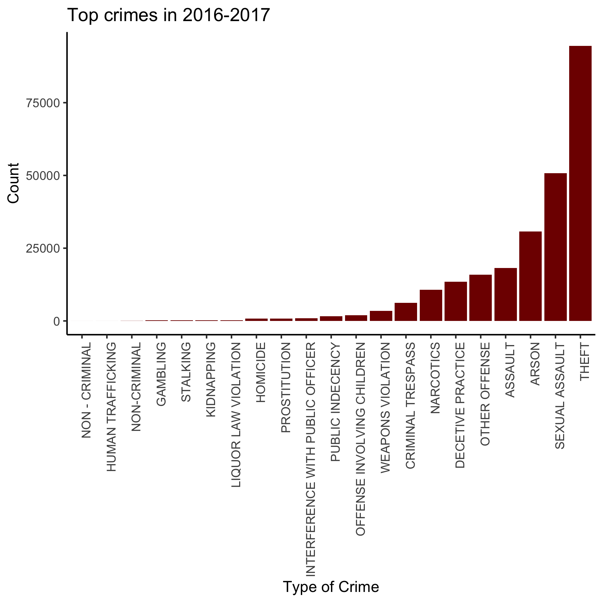
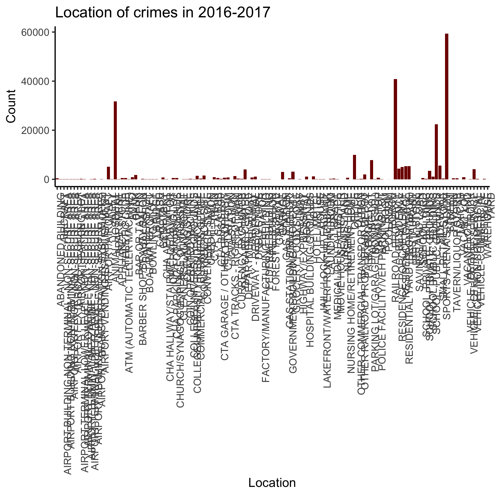

```{r setup, include=FALSE}
knitr::opts_chunk$set(echo = TRUE)
knitr::opts_knit$set(root.dir = here::here())
```

## Foreword

The goal of the project is to analyze the Chicago crimes dataset and build a model that gives us the strongest predictors of an arrest. Essentially, this dataset contains the type of Crime, Location, Sub Category of the Crime, Type of Vicinity and Whether the arrest was possible or not.

This project consists of two phases - Analyzing the dataset, Building a Decision Tree model.

## Table of contents

- Data Load
- Data Cleaning
- Data Analysis
- Decision Tree model
- Results
- Conclusion
- References

## Data Load

This dataset reflects reported incidents of crime (with the exception of murders where data exists for each victim) that occurred in the City of Chicago from 2016 to 2017. Data is extracted from the Chicago Police Department's CLEAR (Citizen Law Enforcement Analysis and Reporting) system. In order to protect the privacy of crime victims, addresses are shown at the block level only and specific locations are not identified. The data is in the following form:



This dataset has 276819 rows and 24 columns 

The dataset includes the following columns:



## Data Cleaning

#### Dealing with Null Values

The first step is to identify all null values in the dataset and remove all of them.

The below features had to be pre-processed to use them in our model: 

. Date : Crime_Date was extracted from the previous Date column 

. Time : Crime_Time was extracted from the previous Date column 

. Domestic crime: 1/0

. Arrest: 1/0 

#### Classifying Data

Let's check the how many crime types we have in the dataset.


The above table shows that several crime types can be combined together.


## Data Analysis

We want to know the top crimes in Chicago from 2016 to 2017.



There were more Theft crime incidents (37.7%) compared to the rest of the offenses. Sexual assault cases came in at 20.2% followed by Arson (12.2%). We can also see drug cases at 4.2% followed by far by criminal trespass cases at 2.4%.

To continue, we want to know the hot locations were most crimes are reported.



We can see that most crimes were committed on the streets (23.7% )followed by residences (16.2%) . And then both apartments (12.6%) and sidewals (8.9%). This figure shows that crime patterns were consistent over multiple regions.

Generally all weekdays are vulnerable to crime. From Monday the crime rate should slowly starts to climb, reach it peak on Friday and go down during Saturdays and Sunday.

Let's now compare the number of crimes with the number of arrests in these years.


From the above plots we can see that the number of arrests recorded in each year is very less compared to the number of crimes. The instances of theft is 94556 whereas the number of arrests for theft is 8479. This means that only 8.9% of the accused actually were arrested. This is followed by cases for Sexual assault where only 20% of the criminals got arrested.

Let's continue and check out the trend across months.


We can see an upward trend starting from May until it peaks in July. Then it gradually goes down until December and spikes again on January. Strangely, less crimes are committed during the month of February. Total crime in Chicago dips during the winter months because even criminals feel cold. We can see that generally, all are vulnerable to theft crimes the rest of the year starting from May until peak in July. Though we can see that most crimes have peak number during month of July.

## Decision Tree model

The benefit of using Decision Tree models is that they are easily understood due to their graphical representation and the simple tests conducted at each node. The tree is built from a set of rules that partition the data by examining value frequency of attributes. At each node the attribute's value is evaluated and depending on the outcome it either takes a route to the next decision node or terminates in a leaf node. A leaf or terminal node indicates the examples of the predicted class.

This was suitable to our dataset which has features like Time, Location, Domestic crime which do not have a direct connection with one another. We thus conducted a Decision Tree analysis on the cleaned dataset for all types of crimes to see the best predictors for an arrest in Chicago. 

Since all the features were categorical, we had to use encoding to represent those features. 

A decision tree can take many hyper - parameters. We performed our experiments with the parameters: [max depth=5] which gave us an accuracy of x%.

More than 50 nodes were created. This tree was then used as a suitable predictor for arrest. 

## Results

From our data EDA we saw that while the total number of crimes changes across months, the category of crime is not in???uenced by the month. We also see that the category of crime changes depending on the hour of the day.  We concluded that adding month as a feature would reduce the accuracy.

The final tree can be visualized below:

Decision Tree


We performed k-fold cross validation to calculate the accuracy of our model. The table below shows the k values and the cross validation scores for the respective k values:

cv <- read.csv("../results/crime_1617_decisiontree_cvscores.csv")
knitr::kable(cv)

Decision Tree learning model with max depth of 5 (shown in Figure above) performed well. The model did not over-???t with this depth as it was signi???cantly lesser than the total number of features at any experiment. 

To calculate the imprtant features we decided to use Scikit-learn's `feature_importances_`. This function computes the importance of a feature is computed as the (normalized) total reduction of the criterion brought by that feature. It is also known as the Gini importance.

## Conclusion

The results from sklearn's `feature_importances_` is displayed below:

features <- read.csv("../results/crime_1617_decisiontree_featuresimportance.csv")
knitr::kable(features)

Thus we conclude that the type of crime (Primary.Type), description of the location where the incident occurred. (Location.Description) and whether the incident was domestic-related or not (Domestic) are the best indicators of an Arrest.

## References

